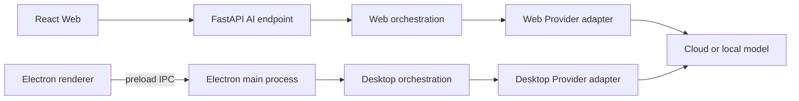

# xnovel AI 接入设计

> 状态：Draft  
> 最后更新：2026-08-15

## 1. 原则

AI 是可选的创作辅助能力，不是正文编辑器的运行前提。用户必须明确触发 AI 任务，并在候选内容写入正文前拥有查看、修改和拒绝权。

## 2. 执行边界

Web 只依赖 xnovel API，不绑定厂商 SDK。Desktop renderer 只依赖 preload 暴露的 AI 接口；主进程负责上下文、Provider 调用和本地结果持久化。

两端的 Provider 适配层统一模型名称、消息格式、流式事件、超时、取消和错误语义，但密钥来源和数据存储彼此独立。

Web 首版使用“内置 Provider 目录 + 自定义 Provider + 四种协议适配器”。内置目录包括 DeepSeek、OpenAI、Anthropic、Google Gemini、OpenRouter、Moonshot AI/Kimi、Z.AI、MiniMax、Mistral、xAI、Groq、Together AI、Fireworks AI、Cerebras、NVIDIA 和 Hugging Face。协议固定为 OpenAI Chat Completions、OpenAI Responses、Anthropic Messages 和 Google Generative AI；不允许用户定义任意请求模板或 Header。

一个 Web 用户在自己的范围内只能拥有一个相同 `provider_id`。Provider 连接可以包含多个手工登记的模型和一个默认模型；自定义 Provider ID 创建后不可修改。模型列表不作为永久内置事实，测试连接只验证当前地址、凭据、协议和模型能否完成最小调用。

## 3. 首批任务类型

- 根据用户选定内容进行构思和情节推演。
- 生成或调整故事大纲。
- 对选中文字进行改写、扩写或压缩。
- 检查人物、时间线和世界设定的一致性。
- 提取候选人物或设定，等待用户确认后写入资料库。

## 4. 上下文策略

- 只发送完成当前任务所需的最小上下文。
- 用户可以看到本次使用的作品范围和文本范围。
- 默认不把完整作品发送给不需要全文的任务。
- 上下文构建与模型调用分离，便于测试和审计。
- 模型输出先保存为候选结果，不直接覆盖正文。

## 5. 密钥、地址与隐私

- Web 使用用户自带密钥。API Key 由 FastAPI 使用 AES-256-GCM 和环境主密钥加密，PostgreSQL 只保存密文、96-bit nonce、算法版本、主密钥版本和脱敏尾号。
- `XNOVEL_CREDENTIAL_MASTER_KEY`、当前版本和轮换期旧密钥只存在服务端 Secret 配置中；生产环境缺失或无效时，AI 凭据服务拒绝启动。
- 浏览器只能得到“已配置”和脱敏尾号，不能通过 API 读回明文。明文不得进入日志、异常、任务表、审计摘要或 OpenAPI 示例。
- 内置云 Provider 按目录规则要求密钥。管理员显式允许的自定义本地 Origin 可以不配置密钥，但界面持续显示“无认证连接”警告。
- 浏览器构建变量不得包含任何模型密钥。
- 内置地址覆盖和自定义 Base URL 都经过部署级 Origin 允许列表。默认只允许公网 HTTPS；HTTP、环回、私网和本机地址必须由管理员显式允许。
- 每次连接前校验 DNS 解析和实际连接目标，拒绝云元数据、链路本地、URL userinfo 和未允许的地址；Provider 请求不跟随重定向。
- Desktop Provider 密钥由主进程使用 Electron `safeStorage` 的异步 API 加解密。应用把密文保存在 `userData/credentials.v1.json`，SQLite 只保存非敏感模型配置、凭据引用和任务元数据。
- Desktop renderer 不接收明文密钥，不直接调用模型 SDK，也不读取加密凭据文件。
- `safeStorage` 只提供操作系统支持的加解密，不持久化密文。Windows 下同一登录用户空间内的其他应用不在其保护边界内。
- 默认作品备份不包含凭据密文。恢复后解密失败或引用缺失时，提示用户重新录入密钥，基础写作继续可用。
- 日志记录 Provider、模型、耗时、实际 Token 用量和结果状态，不记录完整正文。Provider 未返回的用量字段保持为空，不能把估算值标记为实际值。
- 敏感作品是否允许发送到第三方 Provider 必须由部署方和用户策略共同决定。

## 6. Skill 上下文

Skill 是可选的不可信指令上下文，不是可执行插件。用户必须为具体 AI 任务选择一个或多个已启用 Skill；首版不自动把所有 Skill 注入请求，也不自动运行匹配器。

- Web 使用当前用户私有、状态为 `ready` 的不可变 Skill 版本；任务保存 Skill ID、版本 ID、名称、版本号和内容 SHA-256 的无外键标量快照。
- Desktop 使用 `~/.agents/skills/` 中用户已确认启用的一级目录；任务前重新执行 500 文件、50 MiB、`SKILL.md` 1 MiB 和内容指纹校验，并使用本次读取的稳定快照。
- 两端的 `content_sha256` 必须遵循 [`database.md`](database.md) 第 3.5 节的规范路径、Unicode、排序和字节流算法，并共享测试向量。
- 只读取 `SKILL.md` 及其通过相对路径明确引用的 `.md`、`.txt`、`.json`、`.yaml` 或 `.yml` 文本资源；单个资源最多 1 MiB。
- Skill 根目录外路径、链接、脚本、二进制和安装命令一律不可读取或执行。
- Skill 指令低于系统安全规则、作者控制边界和当前任务指令，并以明确分隔的不可信上下文进入模型输入。
- 上下文预算不足时明确拒绝或要求缩小选择，不能静默截断 Skill 指令。

Web Skill 删除后，历史任务保留标量审计快照，但不保留已删除 Skill 的完整文本和资源。Desktop 不伪造 Web Skill ID，只保存目录键、目录名、内容哈希和使用时间快照。

## 7. 失败行为

| 场景               | 行为                                        |
| ------------------ | ------------------------------------------- |
| Provider 超时      | 保留输入和上下文选择，允许用户手动重试      |
| 流式连接中断       | 标记结果不完整，不自动写入正文              |
| 配额不足           | 展示可操作原因，不循环重试                  |
| 内容策略拒绝       | 保留原文，展示 Provider 返回的可公开说明    |
| 用户取消           | 停止下游请求，并将任务标记为取消            |
| Skill 无效或超限   | 拒绝任务，不读取越界内容，也不调用 Provider |
| Desktop Skill 变化 | 自动禁用该 Skill，要求用户重新查看并确认    |

Web 每用户最多同时运行两个 AI 调用，正式任务与连接测试共用槽位。整个 Provider 调用最长 120 秒；有效输出上限取平台硬上限 8,192、模型上限和本次请求值中的最小值。首版不自动重试模型请求，不设置日/月 Token 配额，也不维护价格表。

统一错误码至少覆盖认证失败、权限不足、模型不存在、限流、配额不足、上下文超限、内容拒绝、Provider 不可用、超时、取消、无效响应、地址不允许和并发超限。错误元数据不得保存请求 Header、完整上下文或完整上游响应。

## 8. 已确认实施边界

Web 的 Provider、凭据和用量契约已确定；详细字段、事务和验收规则由本文与 [`database.md`](database.md) 共同定义。实际目录、模型、适配器、流式任务与审计按 T-401 至 T-405 实现。

AI 任务数据保留周期仍需在公开服务上线前确定。Desktop 使用当前设备上的用户凭据，与 Web 凭据不得隐式共享。
