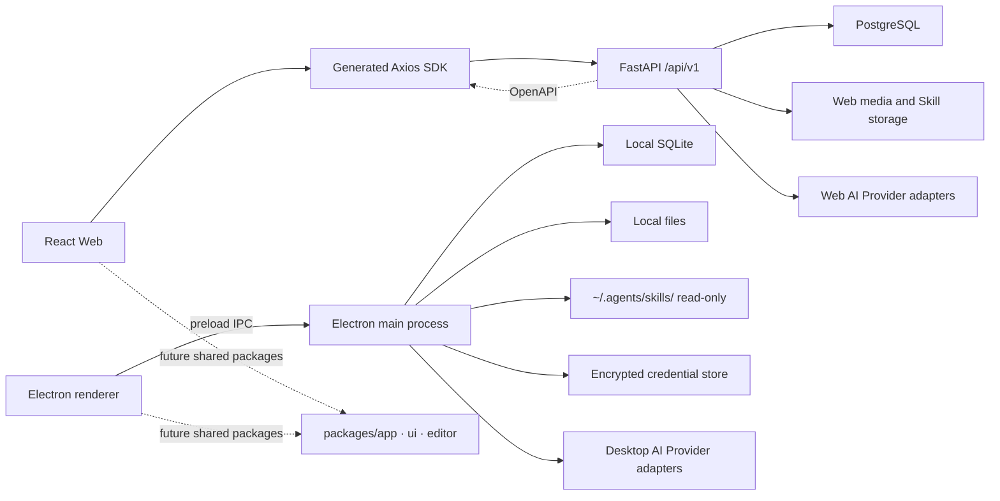

# xnovel 系统架构

> 状态：Draft  
> 最后更新：2026-08-21

## 1. 架构目标

xnovel 采用单仓库、多应用结构，并为 Web 与桌面端保留不同的数据边界。Web 使用登录账户、FastAPI 和 PostgreSQL；桌面端无需登录，使用 Electron 主进程、SQLite 和本地文件。两端只复用稳定的界面与领域能力，不强行共享持久化实现。

## 2. 高层结构



Web 与 Desktop 是两个独立运行边界。Desktop 不把 FastAPI 作为保存正文的前置条件，也不直接连接 PostgreSQL。

## 3. 仓库边界

| 区域           | 职责                                                 | 不承担                   |
| -------------- | ---------------------------------------------------- | ------------------------ |
| `apps/api`     | Web API、PostgreSQL、鉴权、媒体与 Skill、Web AI 调度 | 浏览器界面和桌面本地数据 |
| `apps/web`     | Web 登录、工作台、偏好和私有 Skill 管理界面          | 模型密钥与可信授权       |
| `apps/desktop` | Electron、SQLite、本地文件、只读 Skill、AI 与更新    | 登录和修改本机 Skill     |
| `packages`     | 多个前端消费者稳定复用的领域与界面能力               | 平台数据库连接和提前抽象 |
| `docs`         | 产品、契约和技术决策                                 | 与实现脱节的愿望清单     |

## 4. Web 内部结构

```text
apps/web/src/
├─ app/                    # 启动、Provider 和应用壳层
├─ features/               # 按小说领域组织功能
├─ pages/                  # 路由级页面
├─ shared/                 # API、配置、样式与无业务工具
└─ test/                   # 测试环境和共享测试工具
```

领域模块自包含自己的组件、API、Schema 和测试。两个应用都稳定使用某项能力后，再将其迁入 `packages/`。

## 5. 数据流

### 5.1 Web

1. 页面从用户动作产生用例请求。
2. 领域模块调用由 FastAPI OpenAPI 生成的本地 Axios SDK，并显式传入唯一的运行时 `apiClient`；生成 SDK 不携带未配置的默认客户端。
3. FastAPI 验证身份、输入和作品访问范围。
4. 服务层读写数据库与受控媒体/Skill 存储，或通过内置目录/自定义 Provider 和四种协议适配器发起 AI 请求。
5. API 返回稳定响应；前端只更新与本次操作相关的状态。

Web 使用短期 JWT Access Token 与可撤销的不透明 Refresh Token。Access Token 只保存在浏览器内存，并通过 `Authorization: Bearer <access_token>` 发送；Refresh Token 只存在 `HttpOnly`、生产环境 `Secure`、`SameSite=Lax` Cookie 中。刷新接口校验可信 `Origin`，轮换令牌并保留哈希历史以检测重放。用户名、邮箱和手机号都可以登录；首版只校验格式与唯一性，不实现联系方式验证和找回密码。

当前已实现注册、登录、刷新、退出、当前用户资料和偏好闭环。Web 启动时先应用版本化设备外观缓存，再用 HttpOnly Refresh Cookie 恢复会话；成功后服务端偏好覆盖缓存。并发 `401` 共享一次 Refresh，每个原请求最多重试一次。头像与 Web 全局 Logo 使用 `MEDIA_ROOT` 中的随机存储键，数据库只保存引用和解码后的媒体元数据。

Web 登录后使用统一 AppShell：顶部导航承载品牌和账户入口，侧边栏承载仪表盘、作品、AI 模型和系统设置；管理员额外看到用户、登录日志和操作日志入口。前端根据内存中的用户角色过滤菜单，后端仍是权限最终边界。首次强制改密期间不渲染控制台侧边栏，路由只允许进入改密页面。

Web 使用 `i18next` 和 `react-i18next` 管理 `zh-CN`、`zh-TW`、`en-US`，缺失键回退到 `zh-CN`。五套主题共享浅色和深色语义令牌；`system` 监听操作系统明暗变化。Ant Design 与原生 CSS 使用同一运行时主题表。偏好选择立即应用并按字段自动保存，旧响应不能覆盖更新选择，失败时回滚到最近服务端值。

部署管理员通过 `python -m app.cli create-admin` 创建唯一首个管理员，通过 `python -m app.cli set-registration` 动态切换注册。CLI 与 API 复用身份和密码规则；开关修改与管理员审计处于同一事务。密码只通过隐藏输入读取，不进入参数、日志或审计。

FastAPI 的 `create_app().openapi()` 是 Web API 契约来源。仓库跟踪确定性导出的 `apps/web/openapi/openapi.json` 和 `apps/web/src/shared/api/generated/`；CI 分别检查 Schema 与生成客户端漂移。只有出现第二个真实前端消费者后，才评估迁移到 `packages/api-client/`。

Web AI 使用用户自带密钥。Provider 目录保存公开端点和协议元数据，用户配置保存非敏感连接信息与模型，独立凭据表保存 AES-256-GCM 密文。FastAPI 解密后直接调用 Provider，浏览器不能读取密钥或绕过地址允许列表。正式任务和连接测试共同受每用户两个并发、120 秒超时和 8,192 输出 Token 硬上限约束。

### 5.2 Desktop

1. React renderer 从用户动作产生本地用例请求。
2. preload 只暴露经过校验的窄 IPC 接口。
3. Electron 主进程验证输入并读写 SQLite 或本地文件。
4. AI 任务由主进程构建最小上下文，并调用用户配置的 Provider。
5. 主进程返回可序列化结果；renderer 不获得数据库句柄、文件系统或模型密钥。

Desktop 只读扫描 `~/.agents/skills/` 的一级子目录。启动和手动重新扫描负责发现变化；每次 AI 任务前仍重新校验文件数、累计大小、`SKILL.md` 大小和内容指纹，并使用本次校验捕获的不可变字节，避免检查后替换。preload 只暴露列表、详情、重新扫描、启用和禁用，不暴露写文件能力。

Web 与 Desktop 的 Skill 指纹统一使用 [`database.md`](database.md) 第 3.5 节的清单式 SHA-256；路径规范化、排序、Unicode 碰撞和元数据排除规则不能由平台适配器自行改写。

正文保存和 AI 生成必须是两个独立操作。AI 输出先进入候选结果，用户确认后才能写入正文。

Web 与 Desktop 使用相同的领域标识和业务语义，但维护独立迁移。Desktop 不运行 Alembic，也不复制 PostgreSQL 专用类型或约束。

业务表、关系、并发控制和迁移策略见 [`database.md`](database.md)。

## 6. 错误与恢复

- 读取请求可以对网络瞬时错误有限重试。
- 保存、删除和 AI 计费请求默认不自动重试。
- 保存失败时保留本地编辑内容，并展示再次保存入口。
- AI 请求失败时保留原文、上下文选择和用户指令。
- API 统一返回稳定整数错误码与英文消息标识；Web 根据错误码选择本地化文案。
- Desktop 数据库迁移失败时停止写入，保留原数据库和升级前备份，并提供恢复说明。
- Desktop 卸载和自动更新默认不删除用户数据库、附件或备份。

## 7. 安全边界

- Web Provider 密钥由 FastAPI 使用环境主密钥加密后保存在 PostgreSQL 独立凭据表中；浏览器只能看到配置状态和脱敏尾号。主密钥及轮换期旧密钥只进入服务端 Secret 配置。
- 内置 Provider 地址覆盖和自定义地址都经过部署级 Origin 允许列表、DNS/实际对端校验，并禁止重定向。默认只允许公网 HTTPS；管理员可以显式允许可信本地 Origin。
- Desktop 主进程使用 Electron `safeStorage` 的异步 API 加解密 Provider 密钥。`safeStorage` 不负责保存密文；应用把 Base64 密文写入 `app.getPath("userData")/credentials.v1.json`，SQLite 只保存非敏感配置和 `credential_ref`。
- 凭据服务使用临时文件加原子替换写入密文文件。新增或轮换时先持久化新密文，再提交 SQLite 引用，最后清理旧密文；失败时允许留下可审计的孤立密文，但不能留下指向不存在记录的引用。
- 删除 Provider 配置时先移除 SQLite 引用，再删除对应密文。启动检查只报告悬空引用和孤立密文，不在未确认时自动删除。
- Electron 通过受限 preload API 访问系统能力，不向渲染进程开放 Node.js。
- Web 前端权限只改善体验，FastAPI 执行最终授权。
- Web 受保护接口统一使用 HTTP Bearer。管理接口先验证同一访问令牌，再根据用户角色授权，不使用独立管理请求头或浏览器端运维密钥。Refresh Cookie 用于刷新、退出和修改密码后的当前会话轮换；当前 CSRF 防护是精确 `Origin` 校验和 `SameSite=Lax`，不使用独立 CSRF Token 字段。
- Desktop 没有账户登录和租户授权；主进程仍必须校验 IPC 来源、参数与允许访问的路径。
- 日志默认不记录完整正文和完整模型输入。
- Windows 的 `safeStorage` 主要隔离其他系统账户，不能防止同一登录用户空间中的其他应用。它不是抵御本机同用户恶意程序的凭据保险库。
- Web 头像和全局 Logo 使用随机存储键，服务端检查真实图片类型、解码尺寸和 5 MiB 上限；外链头像只接受 HTTPS，服务端不主动抓取。
- Web Skill 是用户私有数据。上传归档先在隔离区校验 10 MiB 压缩、50 MiB 解压、500 文件、路径规范化和碰撞，再发布不可变版本。
- Skill 文本始终是不可信上下文。Web、FastAPI、Desktop 和 AI 调度器均不执行 Skill 中的脚本、二进制或安装命令。

## 8. 已确认边界

- Web 需要登录，业务数据通过 FastAPI 保存到 PostgreSQL。
- Desktop 无需登录，业务数据保存到用户设备上的 SQLite；封面、附件和导出文件使用本地文件系统。
- Desktop 不捆绑 FastAPI sidecar，也不要求 PostgreSQL。
- 两端暂不自动同步。导入、导出不等同于双向同步。
- Web 支持 `zh-CN`、`zh-TW`、`en-US`；Web 与 Desktop 共用五套主题家族和完整浅色/深色令牌，但不自动同步用户选择。
- Web 管理用户私有 Skill；Desktop 只读使用本机 Skill。两种来源不互相同步，也不共享启用状态。
- 如果以后增加云同步，需要单独设计身份、同步游标、删除传播、冲突解决和端到端测试，不能让 Desktop 直接连接 PostgreSQL。
