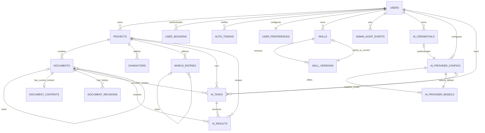

# xnovel 数据库与表设计

> 文档状态：Draft
>
> 文档版本：0.4.0
>
> 最后更新：2026-08-21
>
> 适用范围：首版业务模型与后续演进边界

本文定义 xnovel 的关系数据模型、表职责、约束和迁移规则。Web 使用 FastAPI 与 PostgreSQL；无需登录的 Desktop 使用 Electron 主进程与本地 SQLite。两端共享领域语义，但使用独立的物理 Schema 和迁移链。

## 1. 当前状态

仓库已经具备以下数据库基础设施：

- PostgreSQL 与 `asyncpg` 生产连接配置。
- SQLModel 与 SQLAlchemy 2.0 异步会话。
- Alembic 异步迁移环境。
- T-106 创建账户、偏好、站点设置、管理员审计和认证限流表。
- T-107 创建 `user_sessions`、`user_session_tokens`，并补充 Logo 元数据与登录限流范围。
- API 单元测试使用内存 SQLite；它不是 Desktop 本地数据库实现。

`apps/desktop` 已使用 Electron 内置 `node:sqlite` 建立独立 SQLite v2 Schema、单向迁移、事务、升级前备份和恢复校验。Web 继续使用 SQLModel/Alembic，二者不共享物理迁移。

业务表实现后，事实来源按以下顺序判断：

1. 已应用的 Alembic 迁移。
2. `apps/api/app/models/` 中的 SQLModel 表模型。
3. 数据库约束与自动化测试。
4. 本文的设计说明。

实现与本文不一致时，先确认预期行为，再在同一次变更中修正迁移、模型、测试和文档。

## 2. 设计目标与取舍

### 2.1 首版目标

- 一个用户可以管理多个作品。
- 单文档短篇与多层文档树使用同一作品模型。
- 正文保存支持乐观并发控制，避免静默覆盖。
- 人物与世界设定可以独立查询和维护。
- AI 结果先作为候选内容保存，不能直接覆盖正文。
- Web 本地账号、会话、动态注册和私密资料具有明确约束。
- 用户语言、跨端主题与 Web 私有 Skill 使用可迁移的显式模型。
- 模型凭据不以明文进入数据库。
- Desktop 无需账户登录或网络即可完成创建、写作、保存和重新打开。
- Desktop 应用更新不删除或静默覆盖本地作品。
- Desktop 只保存本地 Skill 偏好和指纹，不复制或修改 Skill 内容。

### 2.2 首版不做

- 多人实时协同编辑与操作变换。
- 数据库分片、读写分离和跨区域复制。
- 段落级版本存储与差量压缩。
- PostgreSQL Row-Level Security（RLS）。
- 通用知识图谱或任意实体关系模型。

首版选择规范化关系表，并只在结构差异较大的扩展属性上使用 JSONB。这样查询和约束保持明确，同时允许人物与设定字段逐步演进。

## 3. 通用约定

### 3.1 PostgreSQL 命名与类型

| 项目       | 约定                                                   |
| ---------- | ------------------------------------------------------ |
| 表名       | 小写复数 `snake_case`，例如 `projects`                 |
| 字段名     | 小写 `snake_case`                                      |
| 数据库名   | 开发、正式与示例固定为 `xnovel`；CI 使用 `xnovel_test` |
| 主键       | 应用生成 UUID v7，数据库类型为 `uuid`                  |
| 外键       | `<entity>_id`，例如 `project_id`                       |
| 时间       | `timestamptz`，统一存储 UTC                            |
| 长文本     | `text`                                                 |
| 状态与类型 | `text` + `CHECK`，避免早期 PostgreSQL Enum 迁移成本    |
| 扩展属性   | `jsonb`，写入前由 Pydantic Schema 校验                 |
| 金额       | `numeric`，不得使用浮点数                              |

所有 PostgreSQL 与 Desktop SQLite 表都必须包含 `created_at` 和 `updated_at`，不为追加表或关联表设置例外。两个字段都非空，并在插入时使用同一个 UTC 当前时间；可变记录每次持久化变更时更新 `updated_at`。`admin_audit_events`、`skill_versions` 和 `document_revisions` 等不可变追加表将 `updated_at` 初始化为 `created_at`，之后禁止修改。

所有持久化表和字段都必须提供简体中文注释。表注释说明数据职责和关键边界，字段注释说明用途、枚举值或隐私约束。PostgreSQL 在 SQLModel 元数据和 Alembic 迁移中保存同一组注释，并通过集成测试逐项比较数据库目录；Desktop SQLite 不保证持久化原生注释，至少在模型和迁移元数据中保留并校验。约束和索引不纳入本规则。

### 3.2 删除策略

- `projects`、`documents`、`characters` 和 `world_entries` 使用 `deleted_at` 软删除。
- 普通 API 不执行硬删除。恢复操作在保留期内清除 `deleted_at`。
- 自动清理周期尚未进入首版；在产品确认保留周期前，不运行自动硬删除任务。
- 执行最终清除时，作品的业务子表按外键级联删除。
- AI 审计与用量数据的保留策略独立于正文回收站策略。

### 3.3 所有权与授权

`projects.owner_id` 是作品访问范围的根。所有子资源通过 `project_id` 继承所有权，服务端必须在查询中校验当前用户与作品的关系。

AI 表保留冗余的 `owner_id` 或 `project_id` 作为租户边界，并使用复合外键阻止跨租户引用：

- `ai_provider_configs(owner_id, credential_id)` 引用 `ai_credentials(owner_id, id)`；无认证自定义连接允许 `credential_id` 为空。
- `ai_provider_models(provider_config_id, id)` 为配置的默认模型复合外键提供目标唯一键。
- `ai_tasks(owner_id, project_id)` 引用 `projects(owner_id, id)`；仅 `provider_connection_test` 允许 `project_id` 为空。
- `ai_tasks(project_id, document_id)` 引用 `documents(project_id, id)`；连接测试的两列都为空。
- `ai_tasks(owner_id, provider_config_id)` 引用 `ai_provider_configs(owner_id, id)`。
- `ai_results(project_id, task_id)` 引用 `ai_tasks(project_id, id)`。
- `ai_results(project_id, applied_document_id)` 引用 `documents(project_id, id)`。

创建任务和应用结果时仍需执行服务层授权检查，并通过集成测试覆盖跨用户 Provider、跨作品文档和跨作品结果三类拒绝路径。

首版不依赖 RLS。若未来增加团队协作，再引入成员表和基于作品的权限关系，不在每张业务表重复角色字段。

### 3.4 Desktop 本地数据库约定

Desktop 使用 SQLite 保存作品、文档、正文、人物、世界设定、AI 非敏感配置、任务和候选结果。封面、附件、导出文件和备份保存在受控的本地目录，SQLite 只保存相对路径、元数据和完整性信息。

| 项目       | Desktop 约定                                               |
| ---------- | ---------------------------------------------------------- |
| 文件位置   | `app.getPath("userData")` 下的 `xnovel.db`                 |
| 访问边界   | 仅 Electron 主进程访问；renderer 通过受限 preload IPC 调用 |
| 主键       | 应用生成 UUID v7，在 SQLite 中保存为规范化 `text`          |
| 时间       | UTC ISO 8601 `text`，读写边界统一解析和格式化              |
| 结构化扩展 | JSON `text`，写入前由共享 Schema 校验                      |
| 外键       | 每次连接启用 `PRAGMA foreign_keys = ON`                    |
| 并发       | 启用 WAL；所有写入通过主进程存储服务串行化或使用明确事务   |
| Schema     | 使用 Desktop 独立版本号和 SQL 迁移，不运行 Alembic         |
| 凭据       | SQLite 只保存凭据引用；主进程用 `safeStorage` 加解密密文   |

Desktop 可以沿用 `projects`、`documents` 等领域名称，但不复制 PostgreSQL 专用类型、租户字段和约束：

- 无登录模式不创建伪造的 `users` 记录，也不要求 `owner_id`。
- JSONB、`timestamptz` 和 PostgreSQL `uuid` 分别映射为经过校验的 JSON 文本、UTC 时间文本和 UUID 文本。
- 乐观锁的 `version`、AI 候选不覆盖正文、软删除和外键完整性仍保持相同语义。
- Web 与 Desktop 暂不自动同步。稳定 UUID 只为导入、导出和未来同步保留身份，不代表已经存在同步协议。

Desktop 加密凭据存储位于 `app.getPath("userData")/credentials.v1.json`。它保存凭据 ID、版本和 Base64 密文，不保存 Provider 密钥明文。`credential_ref` 指向其中的凭据 ID。

凭据与数据库无法共享同一个事务，因此服务层遵循以下顺序：

1. 新增或轮换凭据时，先原子写入新密文，再提交 SQLite 引用，最后删除旧密文。
2. SQLite 提交失败时删除刚写入的新密文；进程崩溃留下的孤立密文由完整性检查报告。
3. 删除 Provider 配置时先清除 SQLite 引用，再删除密文，避免生成新的悬空引用。
4. 启动时检查悬空引用和孤立密文；未获得用户确认前不自动清除无法归属的密文。

### 3.5 Skill 统一内容哈希

Web 和 Desktop 使用同一清单式 SHA-256，不能各自使用平台默认目录遍历或文件元数据哈希：

1. 只枚举普通文件；符号链接、硬链接、Windows 目录联接和其他特殊文件直接拒绝。
2. 相对路径分隔符统一为 `/`，每个路径段执行 Unicode NFC；拒绝空段、`.`、`..`、绝对路径、盘符、UNC、NUL 和无法编码为 UTF-8 的名称。
3. 使用固定的 Unicode 17.0.0 默认完整大小写折叠检测碰撞：读取该版本 [`CaseFolding.txt`](https://www.unicode.org/Public/17.0.0/ucd/CaseFolding.txt) 中状态为 `C` 和 `F` 的映射，不使用 `S` 或 Turkic `T` 映射，未列出的码点映射为自身。碰撞键为 `NFC(full_case_fold_17_0(NFC(path)))`；同时拒绝完全重复路径和文件/目录前缀冲突。哈希清单仍保留通过校验后的原始 NFC 大小写形式。
4. 按完整相对路径的 UTF-8 字节升序排列普通文件。
5. 每个文件依次写入 `uint64-be(path_byte_length) || path_utf8 || uint64-be(content_length) || content_bytes`，对完整字节流计算 SHA-256。

目录条目、空目录、ZIP 条目顺序、时间戳、权限和其他文件系统元数据不参与哈希。文件内容、相对路径、路径大小写或名称变化必须改变哈希；只改变时间戳或权限不能改变哈希。Web 规范化 `.skill` 包使用同一排序与规范路径，并固定归档元数据。

CaseFolding 数据表必须作为带版本与校验信息的共享生成资产或共享实现进入仓库；Python、Node.js、操作系统和 ICU 的运行时大小写转换 API 不能代替该固定表。升级 Unicode 数据版本属于哈希协议变更，必须增加迁移说明和新旧版本兼容测试。

共享测试向量必须至少覆盖不同遍历顺序、不同 ZIP 条目顺序、时间戳和权限变化、Unicode NFC 等价名称、`Straße`/`STRASSE`、希腊 `Σ`/`σ`/`ς`、非 Turkic `İ`、大小写碰撞、重命名和内容变化。Web 与 Desktop 对同一有效目录必须产生完全相同的十六进制摘要与碰撞结论。

## 4. 实体关系



`document_revisions` 属于 P1。图中保留该实体，用于明确正文版本的演进位置；P0 只依赖 `document_contents.version` 处理并发。

## 5. 表清单

| 表                        | 阶段 | 职责                              |
| ------------------------- | ---- | --------------------------------- |
| `users`                   | P0   | Web 本地登录身份、角色与个人资料  |
| `user_sessions`           | P0   | 可撤销的 Web 多设备登录会话       |
| `user_session_tokens`     | P0   | Refresh Token 哈希与轮换历史      |
| `auth_tokens`             | 后续 | 验证和密码找回的一次性令牌哈希    |
| `user_preferences`        | P0   | 用户语言与主题偏好                |
| `site_settings`           | P0   | 动态注册开关与 Web 全局 Logo      |
| `admin_audit_events`      | P0   | 管理员敏感操作审计                |
| `auth_rate_limit_buckets` | P0   | 认证入口的隐私固定窗口计数        |
| `skills`                  | P1   | Web 私有 Skill 当前状态与版本指针 |
| `skill_versions`          | P1   | Web Skill 不可变版本与存储元数据  |
| `projects`                | P0   | 作品聚合根与归档状态              |
| `documents`               | P0   | 作品内可排序的文档树              |
| `document_contents`       | P0   | 文档当前正文与并发版本号          |
| `characters`              | P0   | 人物资料与扩展属性                |
| `world_entries`           | P0   | 世界设定分类与层级内容            |
| `document_character_links` | P0  | 正文与同作品人物的显式引用        |
| `document_world_entry_links` | P0 | 正文与同作品世界设定的显式引用    |
| `ai_credentials`          | P0   | Web 用户 Provider 加密凭据        |
| `ai_provider_configs`     | P0   | Provider 连接、协议与凭据引用     |
| `ai_provider_models`      | P0   | Provider 下的模型与能力边界       |
| `ai_tasks`                | P0   | AI 请求状态、上下文清单与用量     |
| `ai_results`              | P0   | AI 候选结果及作者决策             |
| `document_revisions`      | P1   | 不可变正文快照与恢复来源          |

## 6. 表设计

Phase 4 已实现账户、会话、站点设置、作品、文档、正文、人物、世界设定、两类正文引用，以及 Web Skill、Provider、AI 任务和候选结果表。Desktop SQLite 小节仍是后续任务的规划契约。

### 6.1 `users`

Web 首版采用本地账号。第三方身份以后通过独立映射表扩展，不向本表继续增加通用 Provider 字段。

| 字段                 | 类型        | 必填 | 默认值   | 说明                                                |
| -------------------- | ----------- | ---- | -------- | --------------------------------------------------- |
| `id`                 | uuid        | 是   | 应用生成 | UUID v7 主键                                        |
| `username`           | text        | 是   | -        | NFKC 与 Unicode 大小写折叠后的用户名，长度 `3`–`32` |
| `email`              | text        | 否   | `null`   | 去除首尾空格并转为小写的可选唯一邮箱                |
| `email_verified_at`  | timestamptz | 否   | `null`   | 邮箱验证时间                                        |
| `phone_e164`         | text        | 否   | `null`   | 包含 `+` 和国家码的完整 E.164 手机号                |
| `phone_verified_at`  | timestamptz | 否   | `null`   | 手机验证时间                                        |
| `password_hash`      | text        | 是   | -        | Argon2 密码哈希                                     |
| `nickname`           | text        | 是   | -        | 可重复展示昵称，长度 `1`–`100`                      |
| `must_change_password` | boolean   | 是   | `false`  | 是否必须完成首次密码修改                            |
| `role`               | text        | 是   | `user`   | `user` 或 `admin`                                   |
| `avatar_source`      | text        | 是   | `none`   | `none`、`upload` 或 `url`                           |
| `avatar_storage_key` | text        | 否   | `null`   | 上传头像随机存储键                                  |
| `avatar_mime_type`   | text        | 否   | `null`   | 上传头像解码确认后的 MIME                           |
| `avatar_size_bytes`  | bigint      | 否   | `null`   | 上传头像字节数                                      |
| `avatar_url`         | text        | 否   | `null`   | HTTPS 绝对 URL                                      |
| `avatar_updated_at`  | timestamptz | 否   | `null`   | 头像来源最后更新时间                                |
| `address`            | text        | 否   | `null`   | 私密现住址                                          |
| `birthday`           | date        | 否   | `null`   | 私密生日                                            |
| `status`             | text        | 是   | `active` | `active` 或 `disabled`                              |
| `last_login_at`      | timestamptz | 否   | `null`   | 最近一次完整认证成功时间                            |
| `created_at`         | timestamptz | 是   | `now()`  | 创建时间                                            |
| `updated_at`         | timestamptz | 是   | `now()`  | 最后更新时间                                        |

约束与索引：

- 唯一约束：`username`；`email` 的非空值唯一。
- 部分唯一索引：`phone_e164 WHERE phone_e164 IS NOT NULL`。
- 检查约束：`role IN ('user', 'admin')`、`status IN ('active', 'disabled')`、`avatar_source IN ('none', 'upload', 'url')`。
- 检查约束保证头像来源与字段组合一致：`upload` 要求存储键、MIME、大小和更新时间存在且 URL 为空；`url` 要求 URL 与更新时间存在且上传元数据为空；`none` 要求全部头像字段为空。
- 用户名不能包含 `@`、不能是全数字，也不能以 `+` 后接数字。手机号只接受完整 E.164，不能根据语言或 IP 推断国家码。

服务层在校验长度和唯一性前，先对 `username` 执行 Unicode NFKC，再执行 Unicode 默认大小写折叠（Python `str.casefold()`），并将结果写入 `username`；对 `email` 去除首尾空格并转为小写，再将结果写入 `email`。注册、登录、修改邮箱、首个管理员命令和数据迁移必须复用同一套规范化函数，API 只返回数据库中的规范化值。`nickname` 承担保留用户展示形式的职责。

邮箱和手机号均可为空；非空值占用唯一值，首版可以用于登录，但不用于找回密码。修改邮箱或手机号时同时清除相应验证时间。`address` 与 `birthday` 只允许本人接口读取，管理员列表和详情均不返回。

管理员初始化使用一次性引导密码 `123456`，并将 `must_change_password` 设为 `true`。首次改密前只允许读取本人资料、修改密码、刷新会话和退出登录；其他受保护业务请求由服务端拒绝。

### 6.2 `user_sessions`

| 字段            | 类型        | 必填 | 默认值   | 说明                        |
| --------------- | ----------- | ---- | -------- | --------------------------- |
| `id`            | uuid        | 是   | 应用生成 | 主键                        |
| `user_id`       | uuid        | 是   | -        | 外键 → `users.id`           |
| `expires_at`    | timestamptz | 是   | -        | 会话绝对过期时间            |
| `last_used_at`  | timestamptz | 是   | -        | 最近刷新或敏感操作时间      |
| `revoked_at`    | timestamptz | 否   | `null`   | 会话撤销时间                |
| `revoke_reason` | text        | 否   | `null`   | 不含敏感信息的撤销原因      |
| `created_ip`    | text        | 是   | -        | 创建时规范化客户端 IP       |
| `last_ip`       | text        | 是   | -        | 最近使用的规范化客户端 IP   |
| `user_agent`    | text        | 是   | -        | 截断到 512 字符的客户端信息 |
| `created_at`    | timestamptz | 是   | `now()`  | 创建时间                    |
| `updated_at`    | timestamptz | 是   | `now()`  | 最后更新时间                |

### 6.2.1 `user_session_tokens`

| 字段             | 类型        | 必填 | 默认值   | 说明                      |
| ---------------- | ----------- | ---- | -------- | ------------------------- |
| `id`             | uuid        | 是   | 应用生成 | 主键                      |
| `session_id`     | uuid        | 是   | -        | 外键 → `user_sessions.id` |
| `token_hash`     | bytea       | 是   | -        | 唯一 HMAC-SHA-256 摘要    |
| `expires_at`     | timestamptz | 是   | -        | 原定过期时间              |
| `used_at`        | timestamptz | 否   | `null`   | 完成轮换的时间            |
| `revoked_at`     | timestamptz | 否   | `null`   | 撤销时间                  |
| `replaced_by_id` | uuid        | 否   | `null`   | 替代令牌记录              |
| `created_at`     | timestamptz | 是   | `now()`  | 创建时间                  |
| `updated_at`     | timestamptz | 是   | `now()`  | 最后更新时间              |

Access Token 使用短期 JWT，不存数据库。Refresh Token 原文只存在 HttpOnly Cookie；历史哈希保留到原定过期时间，用于识别旧令牌重放并撤销会话。

### 6.3 `auth_tokens`

| 字段         | 类型        | 必填 | 默认值   | 说明                                               |
| ------------ | ----------- | ---- | -------- | -------------------------------------------------- |
| `id`         | uuid        | 是   | 应用生成 | 主键                                               |
| `user_id`    | uuid        | 是   | -        | 外键 → `users.id`，删除用户时级联删除              |
| `purpose`    | text        | 是   | -        | `verify_email`、`verify_phone` 或 `reset_password` |
| `token_hash` | text        | 是   | -        | 唯一令牌哈希                                       |
| `expires_at` | timestamptz | 是   | -        | 过期时间                                           |
| `used_at`    | timestamptz | 否   | `null`   | 使用时间                                           |
| `created_at` | timestamptz | 是   | `now()`  | 创建时间                                           |
| `updated_at` | timestamptz | 是   | `now()`  | 使用或撤销状态更新时间                             |

同一用户同一用途重新签发时撤销旧令牌。令牌只允许成功使用一次；数据库和日志不得保存明文。

约束与索引：`purpose` 只能使用已列出的三个值，`token_hash` 唯一，并建立 `(user_id, purpose, created_at DESC)` 索引。

### 6.4 `user_preferences`

| 字段            | 类型        | 必填 | 默认值             | 说明                                |
| --------------- | ----------- | ---- | ------------------ | ----------------------------------- |
| `user_id`       | uuid        | 是   | -                  | 主键及外键 → `users.id`，删除时级联 |
| `locale`        | text        | 是   | `zh-CN`            | `zh-CN`、`zh-TW` 或 `en-US`         |
| `theme_palette` | text        | 是   | `manuscript-brown` | 五套主题家族之一                    |
| `theme_mode`    | text        | 是   | `system`           | `system`、`light` 或 `dark`         |
| `created_at`    | timestamptz | 是   | `now()`            | 创建时间                            |
| `updated_at`    | timestamptz | 是   | `now()`            | 最后更新时间                        |

主题家族枚举为 `manuscript-brown`、`pine-green`、`harbor-blue`、`grape-purple` 和 `graphite`。注册与首个管理员事务都创建偏好记录，首版固定使用 `zh-CN`、`manuscript-brown` 和 `system`。

T-108 已实现本人偏好读取与部分更新 API。更新事务只修改请求明确提交的字段；空请求、`null` 和未知枚举由 Schema 拒绝。

### 6.5 `site_settings`

站点设置是固定单例。`id` 是主键并使用 `CHECK (id = 1)`；迁移幂等插入该行，缺行时注册接口按关闭处理。

| 字段                   | 类型        | 必填 | 默认值  | 说明                     |
| ---------------------- | ----------- | ---- | ------- | ------------------------ |
| `id`                   | smallint    | 是   | `1`     | 固定单例键               |
| `registration_enabled` | boolean     | 是   | `false` | 是否允许公开注册         |
| `logo_storage_key`     | text        | 否   | `null`  | Web 全局 Logo 随机存储键 |
| `logo_original_name`   | text        | 否   | `null`  | 清理后的原始文件名       |
| `logo_mime_type`       | text        | 否   | `null`  | 解码确认后的 MIME        |
| `logo_size_bytes`      | bigint      | 否   | `null`  | 文件大小                 |
| `updated_by`           | uuid        | 否   | `null`  | 最近修改管理员           |
| `created_at`           | timestamptz | 是   | `now()` | 单例创建时间             |
| `updated_at`           | timestamptz | 是   | `now()` | 最近修改时间             |

Logo 四个媒体字段必须同时为空或同时有值；文件最大 5 MiB。管理员更新固定主键 `1` 并写审计事件，数据库不可用时不能回退为开放注册。

`updated_by` 外键使用 `ON DELETE SET NULL` 并建立索引；单例读取只允许主键查询或受控 upsert。

### 6.6 `admin_audit_events`

| 字段             | 类型        | 必填 | 默认值   | 说明                             |
| ---------------- | ----------- | ---- | -------- | -------------------------------- |
| `id`             | uuid        | 是   | 应用生成 | UUID v7 主键                     |
| `actor_type`     | text        | 是   | -        | `admin` 或 `system`              |
| `admin_id`       | uuid        | 否   | `null`   | 管理员 UUID 快照，不建立用户外键 |
| `action`         | text        | 是   | -        | 稳定动作标识                     |
| `target_type`    | text        | 是   | -        | 目标类型                         |
| `target_id`      | text        | 否   | `null`   | 可空稳定目标标识                 |
| `change_summary` | jsonb       | 是   | `{}`     | 脱敏后的结构化摘要               |
| `created_at`     | timestamptz | 是   | `now()`  | 创建时间                         |
| `updated_at`     | timestamptz | 是   | `now()`  | 固定等于创建时间                 |

该表只追加不更新，`updated_at` 在插入时与 `created_at` 使用同一时间，之后保持不变。`actor_type = admin` 要求 `admin_id` 非空；`actor_type = system` 要求 `admin_id` 为空。`admin_id` 是无外键历史快照，避免审计阻止受控账户删除。摘要不得包含密码、验证码、令牌、完整邮箱、完整手机号、来源地址或 Skill 内容。

为 `(admin_id, created_at DESC)` 和 `(target_type, target_id, created_at DESC)` 建立索引。

### 6.7 `skills`

| 字段                 | 类型        | 必填 | 默认值   | 说明                                 |
| -------------------- | ----------- | ---- | -------- | ------------------------------------ |
| `id`                 | uuid        | 是   | 应用生成 | UUID v7 主键                         |
| `owner_id`           | uuid        | 是   | -        | 外键 → `users.id`                    |
| `name`               | text        | 是   | -        | 当前版本展示名称，长度 `1`–`100`     |
| `name_normalized`    | text        | 是   | -        | NFKC 与大小写规范化名称              |
| `description`        | text        | 是   | `''`     | 当前版本 frontmatter 描述            |
| `current_version_id` | uuid        | 否   | `null`   | 当前有效版本                         |
| `enabled`            | boolean     | 是   | `false`  | 是否允许新 AI 任务选择               |
| `status`             | text        | 是   | `ready`  | `ready`、`quarantined` 或 `deleting` |
| `deleted_at`         | timestamptz | 否   | `null`   | 删除流程开始时间                     |
| `created_at`         | timestamptz | 是   | `now()`  | 创建时间                             |
| `updated_at`         | timestamptz | 是   | `now()`  | 最后更新时间                         |

对未删除记录建立 `(owner_id, name_normalized)` 部分唯一索引，并建立 `(owner_id)` 完整外键索引。`enabled = true` 只允许 `status = 'ready'` 且当前版本校验通过。

只有安全事件管理员流程可以把状态切换为 `quarantined` 或从隔离恢复为 `ready`，并必须写入 `admin_audit_events`。进入隔离时同一事务设置 `enabled = false`；解除隔离不会自动重新启用，也不允许管理员普通查询读取 Skill 内容。

### 6.8 `skill_versions`

| 字段                             | 类型        | 必填 | 默认值   | 说明                      |
| -------------------------------- | ----------- | ---- | -------- | ------------------------- |
| `id`                             | uuid        | 是   | 应用生成 | 主键                      |
| `skill_id`                       | uuid        | 是   | -        | 外键 → `skills.id`        |
| `version_number`                 | integer     | 是   | -        | Skill 内从 1 递增         |
| `skill_md_text`                  | text        | 是   | -        | 当前版本 `SKILL.md`       |
| `source_kind`                    | text        | 是   | -        | `upload` 或 `editor`      |
| `source_archive_storage_key`     | text        | 否   | `null`   | 原始上传包；编辑版为空    |
| `normalized_package_storage_key` | text        | 是   | -        | 确定性规范化 `.skill` 包  |
| `content_storage_key`            | text        | 是   | -        | 校验后不可变版本目录      |
| `content_sha256`                 | text        | 是   | -        | 统一清单算法 SHA-256      |
| `source_compressed_size`         | bigint      | 否   | `null`   | 原始上传包大小            |
| `normalized_package_size`        | bigint      | 是   | -        | 规范化包大小              |
| `uncompressed_size`              | bigint      | 是   | -        | 解压累计大小，最大 50 MiB |
| `file_count`                     | integer     | 是   | -        | 文件数，最大 500          |
| `validation_summary`             | jsonb       | 是   | `{}`     | 不含完整内容的校验摘要    |
| `created_at`                     | timestamptz | 是   | `now()`  | 创建时间                  |
| `updated_at`                     | timestamptz | 是   | `now()`  | 固定等于创建时间          |

唯一约束为 `(skill_id, version_number)` 和 `(skill_id, id)`。`skills(id, current_version_id)` 使用 `DEFERRABLE INITIALLY DEFERRED` 复合外键引用 `skill_versions(skill_id, id)`，允许创建事务内暂时为空，但提交前必须指向同一 Skill 的有效版本。上传、编辑和 current projection 更新在同一事务完成；名称冲突时保留原当前版本。

`source_kind` 使用检查约束：`upload` 要求原始归档键和大小同时存在，`editor` 要求两者同时为空。大小和文件数均为非负，`uncompressed_size <= 52,428,800`、`file_count <= 500`，`content_sha256` 是 64 位小写十六进制字符串。`skill_id` 的两个唯一约束均可覆盖外键引用和版本查询。该表只追加不更新，`updated_at` 固定等于 `created_at`。

### 6.9 `projects`

作品是业务聚合根。篇幅不决定表结构，短篇与长篇只通过文档组织方式区分。

| 字段             | 类型        | 必填 | 默认值   | 说明                        |
| ---------------- | ----------- | ---- | -------- | --------------------------- |
| `id`             | uuid        | 是   | 应用生成 | 主键                        |
| `owner_id`       | uuid        | 是   | -        | 外键 → `users.id`           |
| `title`          | text        | 是   | -        | 作品名，长度 `1`–`200`      |
| `description`    | text        | 是   | `''`     | 梗概或备注                  |
| `structure_mode` | text        | 是   | `tree`   | `single_document` 或 `tree` |
| `status`         | text        | 是   | `active` | `active` 或 `archived`      |
| `archived_at`    | timestamptz | 否   | `null`   | 归档时间                    |
| `deleted_at`     | timestamptz | 否   | `null`   | 回收站时间                  |
| `created_at`     | timestamptz | 是   | `now()`  | 创建时间                    |
| `updated_at`     | timestamptz | 是   | `now()`  | 最后更新时间                |

约束与索引：

- 外键：`owner_id` 引用 `users.id`，普通删除使用 `RESTRICT`。
- 唯一约束：`(owner_id, id)`，供 AI 任务的同所有者外键引用。
- 检查约束：`structure_mode IN ('single_document', 'tree')`。
- 检查约束：`status IN ('active', 'archived')`。
- 索引：`(owner_id)`，覆盖完整外键引用检查。
- 部分索引：`(owner_id, status, updated_at DESC) WHERE deleted_at IS NULL`。

同一用户可以创建同名作品，不设置标题唯一约束。

### 6.10 `documents`

该表保存树结构与文档元数据，不保存正文。文件夹节点不创建 `document_contents`。

| 字段         | 类型        | 必填 | 默认值       | 说明                                        |
| ------------ | ----------- | ---- | ------------ | ------------------------------------------- |
| `id`         | uuid        | 是   | 应用生成     | 主键                                        |
| `project_id` | uuid        | 是   | -            | 外键 → `projects.id`                        |
| `parent_id`  | uuid        | 否   | `null`       | 自引用父节点；`null` 表示根级               |
| `kind`       | text        | 是   | `manuscript` | `folder`、`manuscript`、`outline` 或 `note` |
| `title`      | text        | 是   | -            | 节点标题，长度 `1`–`200`                    |
| `position`   | bigint      | 是   | `0`          | 同级排序值，必须大于或等于 `0`              |
| `status`     | text        | 是   | `active`     | `active` 或 `archived`                      |
| `deleted_at` | timestamptz | 否   | `null`       | 回收站时间                                  |
| `created_at` | timestamptz | 是   | `now()`      | 创建时间                                    |
| `updated_at` | timestamptz | 是   | `now()`      | 最后更新时间                                |

约束与索引：

- 外键：`project_id` 引用 `projects.id`。
- 自引用：`parent_id` 引用 `documents.id`。
- 检查约束：`id <> parent_id`。
- 检查约束：`kind` 和 `status` 只能使用已列出的值。
- 唯一约束：`(project_id, id)`，供同作品父节点外键引用。
- 复合外键：`(project_id, parent_id)` 引用 `(project_id, id)`，确保父子节点属于同一作品。
- 索引：`(project_id, parent_id, position)`。
- 索引：`(project_id, updated_at DESC) WHERE deleted_at IS NULL`。
- 索引：`(parent_id)`，覆盖包含软删除行的父节点引用检查。

数据库外键不能独立阻止深层循环。移动节点时，服务层必须在同一事务中确认目标不是当前节点的后代。

文档创建接口开放 `folder`、`manuscript` 和 `outline`；`note` 保留给后续能力。大纲复用 `document_contents`、纯文本格式和版本锁，不进入正文导出。同一作品的树写事务先锁定作品聚合根，避免并发追加产生重复位置；活动树排序再锁定来源和目标同级，核对请求提交的完整节点顺序与各节点提交前 `updated_at`，然后连续写入 `0..n-1`。集合遗漏、重复、额外节点或并发变化返回 `409`，不会静默覆盖新顺序。

归档节点不参与活动树排序，恢复时追加到仍然有效的父文件夹末尾。非空文件夹不能归档或删除；文件夹移动不能形成循环。作品必须始终保留至少一个未删除、未归档的 `manuscript`。归档、恢复、移动和软删除都在同一事务更新受影响同级位置与作品 `updated_at`。

### 6.11 `document_contents`

该表保存每个非文件夹文档的当前内容。将正文与树节点分开，可以降低频繁自动保存对目录查询的影响。

| 字段             | 类型        | 必填 | 默认值       | 说明                           |
| ---------------- | ----------- | ---- | ------------ | ------------------------------ |
| `document_id`    | uuid        | 是   | -            | 主键，外键 → `documents.id`    |
| `content`        | text        | 是   | `''`         | 当前正文                       |
| `content_format` | text        | 是   | `plain_text` | `plain_text` 或 `markdown`     |
| `version`        | bigint      | 是   | `1`          | 乐观并发版本号，每次保存加 `1` |
| `word_count`     | integer     | 是   | `0`          | 服务端统一计算的字数           |
| `checksum`       | text        | 是   | -            | 内容 SHA-256，用于识别重复保存 |
| `updated_by`     | uuid        | 否   | `null`       | 外键 → `users.id`              |
| `created_at`     | timestamptz | 是   | `now()`      | 正文记录创建时间               |
| `updated_at`     | timestamptz | 是   | `now()`      | 最后保存时间                   |

约束与索引：

- `document_id` 使用 `ON DELETE CASCADE`，只在最终硬删除时生效。
- 检查约束：`version > 0`、`word_count >= 0`。
- 检查约束：`content_format IN ('plain_text', 'markdown')`。
- 索引：`(updated_by)`，支持用户引用检查。

保存请求必须携带客户端读取到的 `version`。更新语句同时匹配 `document_id` 和旧版本号；影响行数为 `0` 时返回 HTTP `409`，不能覆盖数据库中的新版本。

### 6.12 `characters`

| 字段         | 类型        | 必填 | 默认值   | 说明                         |
| ------------ | ----------- | ---- | -------- | ---------------------------- |
| `id`         | uuid        | 是   | 应用生成 | 主键                         |
| `project_id` | uuid        | 是   | -        | 外键 → `projects.id`         |
| `name`       | text        | 是   | -        | 人物名，长度 `1`–`200`       |
| `aliases`    | jsonb       | 是   | `[]`     | 字符串数组，保存别名         |
| `summary`    | text        | 是   | `''`     | 简介或角色定位               |
| `profile`    | jsonb       | 是   | `{}`     | 经 Schema 校验的扩展人物字段 |
| `position`   | bigint      | 是   | `0`      | 列表排序值                   |
| `deleted_at` | timestamptz | 否   | `null`   | 回收站时间                   |
| `created_at` | timestamptz | 是   | `now()`  | 创建时间                     |
| `updated_at` | timestamptz | 是   | `now()`  | 最后更新时间                 |

索引：

- `(project_id, position, id)`，支持稳定人物排序。
- `(project_id, updated_at, id) WHERE deleted_at IS NULL`，支持活动人物刷新。

### 6.13 `world_entries`

世界设定允许分类和层级组织。移动使用完整受影响同级集合和 `updated_at` 并发检查，拒绝循环；非空节点不能删除。

| 字段         | 类型        | 必填 | 默认值   | 说明                                                      |
| ------------ | ----------- | ---- | -------- | --------------------------------------------------------- |
| `id`         | uuid        | 是   | 应用生成 | 主键                                                      |
| `project_id` | uuid        | 是   | -        | 外键 → `projects.id`                                      |
| `parent_id`  | uuid        | 否   | `null`   | 自引用父设定                                              |
| `category`   | text        | 是   | `other`  | `location`、`faction`、`item`、`rule`、`event` 或 `other` |
| `title`      | text        | 是   | -        | 设定名称，长度 `1`–`200`                                  |
| `content`    | text        | 是   | `''`     | 设定正文                                                  |
| `attributes` | jsonb       | 是   | `{}`     | 经 Schema 校验的扩展属性                                  |
| `position`   | bigint      | 是   | `0`      | 同级排序值                                                |
| `deleted_at` | timestamptz | 否   | `null`   | 回收站时间                                                |
| `created_at` | timestamptz | 是   | `now()`  | 创建时间                                                  |
| `updated_at` | timestamptz | 是   | `now()`  | 最后更新时间                                              |

约束与索引：

- 检查约束：`id <> parent_id`。
- 检查约束：`category` 只能使用已列出的值。
- 唯一约束：`(project_id, id)`，供同作品父设定外键引用。
- 复合外键：`(project_id, parent_id)` 引用 `(project_id, id)`。
- 索引：`(project_id, parent_id, position, id)`。
- 部分索引：`(project_id, updated_at, id) WHERE deleted_at IS NULL`。
- 索引：`(parent_id)`，覆盖包含软删除行的父设定引用检查。

### 6.13.1 `document_character_links`

正文与人物使用显式关联表。字段为 UUID 主键、`project_id`、`document_id`、`character_id` 和公共时间戳。复合外键分别引用 `(project_id, document_id)` 与 `(project_id, character_id)`，确保两端属于同一作品；唯一约束禁止重复引用。删除文档或人物时级联删除关联。

### 6.13.2 `document_world_entry_links`

正文与世界设定关联表字段为 UUID 主键、`project_id`、`document_id`、`world_entry_id` 和公共时间戳。复合外键、唯一约束和级联规则与人物引用一致。关联只表达资源集合，不保存正文选区、位置或自动抽取结果。

人物 `aliases` 最多 20 项；人物 `profile` 与世界设定 `attributes` 首版为最多 50 项的字符串键值对象，键最长 100 字符，值最长 2,000 字符。人物和世界设定软删除时同步移除显式引用。

### 6.14 `ai_credentials`

该表保存 Web 用户 Provider API Key 的应用层密文，不保存明文。主密钥不进入数据库。

| 字段                 | 类型        | 必填 | 默认值        | 说明                            |
| -------------------- | ----------- | ---- | ------------- | ------------------------------- |
| `id`                 | uuid        | 是   | 应用生成      | 主键                            |
| `owner_id`           | uuid        | 是   | -             | 外键 → `users.id`               |
| `ciphertext`         | bytea       | 是   | -             | AES-256-GCM 密文及认证标签      |
| `nonce`              | bytea       | 是   | -             | 每次加密独立生成的 96-bit nonce |
| `algorithm`          | text        | 是   | `AES-256-GCM` | 加密算法版本                    |
| `master_key_version` | text        | 是   | -             | 解密所需主密钥版本              |
| `key_hint`           | text        | 是   | -             | 仅供确认的脱敏尾号              |
| `created_at`         | timestamptz | 是   | `now()`       | 创建时间                        |
| `updated_at`         | timestamptz | 是   | `now()`       | 最近重加密时间                  |

约束与索引：

- `owner_id` 使用 `ON DELETE CASCADE`。
- 唯一约束：`(owner_id, id)`，供 Provider 配置复合外键引用。
- 检查约束：`algorithm = 'AES-256-GCM'`、`octet_length(nonce) = 12`，且 `master_key_version` 非空。
- 索引：`(owner_id, updated_at DESC)`，供用户删除与主密钥轮换扫描。

AAD 绑定 `owner_id`、`id` 与 `master_key_version`。API 不提供读取明文的路径；错误消息、日志和审计摘要不得包含 `ciphertext`、`nonce`、主密钥或 API Key。

### 6.15 `ai_provider_configs`

该表保存用户范围内唯一的 Provider 连接、协议、可选凭据和默认模型引用。

| 字段               | 类型        | 必填 | 默认值   | 说明                                                       |
| ------------------ | ----------- | ---- | -------- | ---------------------------------------------------------- |
| `id`               | uuid        | 是   | 应用生成 | 主键                                                       |
| `owner_id`         | uuid        | 是   | -        | 外键 → `users.id`                                          |
| `source`           | text        | 是   | -        | `builtin` 或 `custom`                                      |
| `provider_id`      | text        | 是   | -        | 用户范围内唯一且创建后不可修改的 Provider ID               |
| `display_name`     | text        | 是   | -        | 用户可识别的显示名称                                       |
| `protocol`         | text        | 是   | -        | `openai_chat`、`openai_responses`、`anthropic` 或 `google` |
| `base_url`         | text        | 否   | `null`   | 内置项为空时使用目录 Origin；覆盖与自定义地址存规范化 URL  |
| `credential_id`    | uuid        | 否   | `null`   | 同所有者 `ai_credentials.id`                               |
| `default_model_id` | uuid        | 是   | -        | 同一配置下的默认模型                                       |
| `enabled`          | boolean     | 是   | `true`   | 是否可用于新任务                                           |
| `created_at`       | timestamptz | 是   | `now()`  | 创建时间                                                   |
| `updated_at`       | timestamptz | 是   | `now()`  | 最后更新时间                                               |

约束与索引：

- 唯一约束：`(owner_id, provider_id)`；内置 ID 是保留字，自定义 ID 不能占用。
- 唯一约束：`(owner_id, id)`，供 AI 任务的同所有者外键引用。
- 唯一约束：`(owner_id, credential_id) WHERE credential_id IS NOT NULL`，一个凭据只服务一个配置。
- `owner_id` 使用 `ON DELETE CASCADE`。
- 复合外键：`(owner_id, credential_id)` 引用 `ai_credentials(owner_id, id)`，使用 `DEFERRABLE INITIALLY DEFERRED` 与 `ON DELETE NO ACTION`；直接删除凭据前必须清空配置引用，账户删除按 8.8 节的受控顺序先删除配置再删除凭据。
- 延迟复合外键：`(id, default_model_id)` 引用 `ai_provider_models(provider_config_id, id)`，使用 `DEFERRABLE INITIALLY DEFERRED` 与 `ON DELETE NO ACTION`；这样删除整个配置时模型可级联清理，而单独删除默认模型仍必须先切换默认值。
- 检查约束：`source`、`protocol` 只能使用已列出的值；`provider_id` 匹配 `^[a-z][a-z0-9-]{1,62}$`；`source = 'custom'` 时 `base_url` 非空。
- 索引：`(owner_id, enabled)`、`(credential_id)` 和 `(default_model_id)`。

服务层要求 `source = 'builtin'` 的 `provider_id`、协议和默认 Origin 匹配 [`ai-integration.md`](ai-integration.md) 的内置目录，并阻止自定义配置占用保留 ID。内置云 Provider 按目录规则要求 `credential_id` 非空。只有 `source = 'custom'`、Origin 被部署管理员显式允许且界面返回无认证警告时，服务层才允许空凭据。地址覆盖和自定义地址在保存及每次调用前都执行地址策略，数据库 URL 不是访问授权。

### 6.16 `ai_provider_models`

一个 Provider 配置包含一个或多个手工确认的模型；模型目录不是永久事实。

| 字段                 | 类型        | 必填 | 默认值   | 说明                            |
| -------------------- | ----------- | ---- | -------- | ------------------------------- |
| `id`                 | uuid        | 是   | 应用生成 | 主键                            |
| `provider_config_id` | uuid        | 是   | -        | 外键 → `ai_provider_configs.id` |
| `model_id`           | text        | 是   | -        | 发送给 Provider 的模型标识      |
| `display_name`       | text        | 是   | -        | 模型选择器显示名称              |
| `context_window`     | integer     | 是   | -        | 用户确认的上下文窗口            |
| `max_output_tokens`  | integer     | 是   | -        | 模型声明的最大输出能力          |
| `supports_streaming` | boolean     | 是   | `true`   | 是否允许流式文本                |
| `enabled`            | boolean     | 是   | `true`   | 是否可用于新任务                |
| `created_at`         | timestamptz | 是   | `now()`  | 创建时间                        |
| `updated_at`         | timestamptz | 是   | `now()`  | 最后更新时间                    |

约束与索引：

- `provider_config_id` 使用 `ON DELETE CASCADE`。
- 唯一约束：`(provider_config_id, model_id)` 和 `(provider_config_id, id)`。
- 检查约束：`model_id`、`display_name` 非空，`context_window > 0`，且 `0 < max_output_tokens <= context_window`。
- 索引：`(provider_config_id, enabled)`。

创建 Provider 时使用预生成配置 ID、模型 ID和延迟外键在同一事务插入。服务层保证提交时至少存在一个启用模型，默认模型属于该配置且已启用；删除或禁用默认模型前必须先切换默认值。

### 6.17 `ai_tasks`

AI 任务记录调度状态和最小必要上下文清单。它不复制完整作品正文作为日志。

| 字段                 | 类型        | 必填 | 默认值   | 说明                                                      |
| -------------------- | ----------- | ---- | -------- | --------------------------------------------------------- |
| `id`                 | uuid        | 是   | 应用生成 | 主键                                                      |
| `owner_id`           | uuid        | 是   | -        | 外键 → `users.id`，使用 `ON DELETE RESTRICT`              |
| `project_id`         | uuid        | 否   | `null`   | 正式任务的作品外键；连接测试必须为空                      |
| `document_id`        | uuid        | 否   | `null`   | 可选上下文文档                                            |
| `provider_config_id` | uuid        | 否   | `null`   | 使用的配置引用；配置停用后历史任务仍保留该引用            |
| `task_type`          | text        | 是   | -        | 任务类型                                                  |
| `provider`           | text        | 是   | -        | 实际 Provider 快照                                        |
| `model`              | text        | 是   | -        | 实际模型快照                                              |
| `instruction`        | text        | 是   | -        | 用户明确提交的指令                                        |
| `context_manifest`   | jsonb       | 是   | `{}`     | 文档范围与 Skill 标量快照，不含完整正文或完整 Skill 内容  |
| `status`             | text        | 是   | `queued` | `queued`、`running`、`succeeded`、`failed` 或 `cancelled` |
| `error_code`         | text        | 否   | `null`   | 稳定错误标识                                              |
| `error_message`      | text        | 否   | `null`   | 脱敏错误说明                                              |
| `input_tokens`       | integer     | 否   | `null`   | Provider 返回的输入 Token 数                              |
| `output_tokens`      | integer     | 否   | `null`   | Provider 返回的输出 Token 数                              |
| `cache_read_tokens`  | integer     | 否   | `null`   | Provider 返回的缓存读取 Token 数                          |
| `reasoning_tokens`   | integer     | 否   | `null`   | Provider 返回的推理 Token 数                              |
| `cancel_requested_at` | timestamptz | 否   | `null`   | 用户请求取消的时间；执行器据此丢弃迟到流                  |
| `started_at`         | timestamptz | 否   | `null`   | 开始执行时间                                              |
| `finished_at`        | timestamptz | 否   | `null`   | 终止时间                                                  |
| `created_at`         | timestamptz | 是   | `now()`  | 创建时间                                                  |
| `updated_at`         | timestamptz | 是   | `now()`  | 最后更新时间                                              |

`task_type` 首版允许 `provider_connection_test`、`brainstorm`、`outline`、`rewrite`、`expand`、`compress`、`consistency` 和 `extract_settings`。

索引：

- `(owner_id, created_at DESC)`。
- `(project_id, status, created_at DESC) WHERE project_id IS NOT NULL`。
- `(owner_id, project_id)`，支持同所有者作品复合外键。
- `(project_id, document_id)`，支持同作品文档复合外键。
- `(owner_id, provider_config_id)`，支持同所有者 Provider 复合外键。
- `(document_id)`，支持文档引用检查和任务反查。
- `(provider_config_id)`，支持配置引用检查。
- `(status, created_at)`，供任务调度器领取任务。

约束：

- 唯一约束：`(project_id, id)`，供结果表的同作品外键引用。
- 复合外键：非空的 `(owner_id, project_id)`、`(project_id, document_id)` 和 `(owner_id, provider_config_id)` 按第 3.3 节定义。
- 检查约束：`provider_connection_test` 要求 `project_id IS NULL`、`document_id IS NULL`、`instruction = 'provider_connection_test'`；其他任务要求 `project_id IS NOT NULL` 且 `instruction` 非空。
- 检查约束：`status` 只能是 `queued`、`running`、`succeeded`、`failed` 或 `cancelled`。
- 检查约束：`queued` 要求 `started_at IS NULL`、`finished_at IS NULL` 且 `error_code IS NULL`；`running` 要求 `started_at IS NOT NULL`、`finished_at IS NULL` 且 `error_code IS NULL`；`succeeded` 要求 `started_at IS NOT NULL`、`finished_at IS NOT NULL` 且 `error_code IS NULL`；`failed` 与 `cancelled` 要求 `finished_at IS NOT NULL` 且 `error_code IS NOT NULL`，允许因开始前拒绝而保持 `started_at IS NULL`。
- 检查约束：四个 Token 用量字段为空或大于等于 `0`。Provider 未报告的字段保持为空，不能写入估算值。

Provider 配置的任务复合外键使用 `ON DELETE RESTRICT`。日常移除只把配置设为 `enabled = false`；确需硬删除时，服务层在同一事务中先将历史任务的 `provider_config_id` 置为 `null`，再删除配置并级联删除模型，最后删除不再被引用的凭据密文。集成测试必须验证历史快照保留且所有者边界不被清空。

`context_manifest.skills` 中的 Web Skill 项只保存 `skill_id_snapshot`、`skill_version_id_snapshot`、`skill_name_snapshot`、`skill_version_number_snapshot` 和 `content_sha256`。这些值不建立到 `skills` 或 `skill_versions` 的外键，Skill 删除后仍作为历史标识保留，但不保留已删除内容。

任务先以 `queued` 创建。开始事务按用户取得 PostgreSQL 事务级 advisory lock，并在同一事务内完成以下状态转换：

1. 将 `started_at <= now() - interval '120 seconds'` 的遗留 `running` 任务更新为 `failed`，写入 `finished_at = now()`、`error_code = 'AI_TIMEOUT'` 和脱敏错误说明。
2. 统计该用户剩余的 `running` 任务。已有两个时，把本次 `queued` 任务更新为 `failed`，写入 `finished_at = now()` 与 `error_code = 'AI_CONCURRENCY_LIMIT'`，提交后返回并发超限。
3. 仍有槽位时，把本次任务以 `WHERE status = 'queued'` 原子更新为 `running` 并写入 `started_at = now()`；更新行数不是 `1` 时拒绝调用 Provider。
4. 提交事务后才调用 Provider。Provider 成功、失败或整体超时都必须使用 `WHERE status = 'running'` 的条件更新转入对应终态并写入 `finished_at`；用户取消可以把 `queued` 或 `running` 条件更新为 `cancelled`。任何终态更新的影响行数不是 `1`，都表示任务已被取消、回收或由其他执行者结束，当前执行者必须立即丢弃后续流、用量和响应，不得覆盖终态。
5. 成功路径在同一事务中先以 `WHERE status = 'running'` 把任务更新为 `succeeded`，确认影响一行后才插入 `ai_results`；更新失败时不创建候选。首版不保存中断或迟到的部分输出。

槽位的回收、统计和当前任务预占必须持有同一把用户锁，不能在释放锁后再更新状态。任务终态只能单向写入，不能从一个终态转换为另一终态或恢复为 `running`。连接测试最多生成 1 token，不产生 `ai_results`，但与正式任务使用同一状态、错误和实际用量字段。

### 6.18 `ai_results`

AI 输出与作者正文分离。只有显式“应用”操作才能把候选内容写入 `document_contents`。

| 字段                  | 类型        | 必填 | 默认值      | 说明                                 |
| --------------------- | ----------- | ---- | ----------- | ------------------------------------ |
| `id`                  | uuid        | 是   | 应用生成    | 主键                                 |
| `project_id`          | uuid        | 是   | -           | 作品边界，必须与任务一致             |
| `task_id`             | uuid        | 是   | -           | 外键 → `ai_tasks.id`                 |
| `sequence`            | integer     | 是   | `0`         | 同一任务内候选顺序                   |
| `content`             | text        | 是   | -           | 模型候选内容                         |
| `status`              | text        | 是   | `candidate` | `candidate`、`applied` 或 `rejected` |
| `applied_document_id` | uuid        | 否   | `null`      | 应用到的文档                         |
| `decided_at`          | timestamptz | 否   | `null`      | 作者作出决定的时间                   |
| `created_at`          | timestamptz | 是   | `now()`     | 创建时间                             |
| `updated_at`          | timestamptz | 是   | `now()`     | 状态最后更新时间                     |

约束与索引：

- 唯一约束：`(task_id, sequence)`。
- 检查约束：`sequence >= 0`。
- 检查约束：`status` 只能使用已列出的值。
- 复合外键：`(project_id, task_id)` 与 `(project_id, applied_document_id)` 按第 3.3 节定义。
- 索引：`(task_id, status)`。
- 索引：`(project_id, created_at DESC)`。
- 索引：`(project_id, task_id)` 与 `(project_id, applied_document_id)`，支持同作品复合外键。
- 索引：`(applied_document_id)`，支持目标文档引用检查。

状态组合使用数据库 `CHECK` 约束：

- `candidate`：`applied_document_id IS NULL` 且 `decided_at IS NULL`。
- `applied`：`applied_document_id IS NOT NULL` 且 `decided_at IS NOT NULL`。
- `rejected`：`applied_document_id IS NULL` 且 `decided_at IS NOT NULL`。

应用候选结果时，服务层必须在一个事务中校验作品权限、正文版本和结果状态。成功写入正文后再把结果标记为 `applied`；任何一步失败都回滚。

### 6.19 `auth_rate_limit_buckets`

该表保存认证入口的固定窗口计数，只保存 HMAC-SHA-256 摘要，不保存来源地址、用户名或邮箱原文。

| 字段                | 类型        | 必填 | 默认值   | 说明                                                    |
| ------------------- | ----------- | ---- | -------- | ------------------------------------------------------- |
| `id`                | uuid        | 是   | 应用生成 | UUID v7 主键                                            |
| `scope`             | text        | 是   | -        | `registration_source` 或 `registration_source_identity` |
| `key_hash`          | bytea       | 是   | -        | 32 字节 HMAC-SHA-256 摘要                               |
| `window_started_at` | timestamptz | 是   | -        | 向下取整到 600 秒边界的 UTC 窗口起点                    |
| `window_seconds`    | integer     | 是   | `600`    | 窗口秒数                                                |
| `attempt_count`     | integer     | 是   | `1`      | 当前窗口累计次数                                        |
| `created_at`        | timestamptz | 是   | `now()`  | 首次计数时间                                            |
| `updated_at`        | timestamptz | 是   | `now()`  | 最近一次原子递增时间                                    |

唯一约束为 `(scope, key_hash, window_started_at)`。`window_seconds` 与 `attempt_count` 必须大于 `0`，并为 `(window_started_at, window_seconds)` 建立过期清理索引。

注册限流使用独立短事务执行 `INSERT ... ON CONFLICT DO UPDATE ... RETURNING`，并在注册业务校验和写入前提交。来源桶限制为 10 次/10 分钟，来源与规范化用户名、邮箱组合桶限制为 3 次/10 分钟；任一桶超限都保留递增结果。

## 7. P1 版本历史

`document_revisions` 保存不可变正文快照。P1 实施前必须先在 `docs/prd.md` 确认保留周期和恢复体验。

| 字段             | 类型        | 必填 | 默认值   | 说明                                          |
| ---------------- | ----------- | ---- | -------- | --------------------------------------------- |
| `id`             | uuid        | 是   | 应用生成 | 主键                                          |
| `document_id`    | uuid        | 是   | -        | 外键 → `documents.id`                         |
| `version`        | bigint      | 是   | -        | 对应正文版本                                  |
| `content`        | text        | 是   | -        | 不可变正文快照                                |
| `content_format` | text        | 是   | -        | 快照格式                                      |
| `source`         | text        | 是   | `manual` | `manual`、`autosave`、`ai_apply` 或 `restore` |
| `actor_id`       | uuid        | 否   | `null`   | 触发变更的用户                                |
| `created_at`     | timestamptz | 是   | `now()`  | 快照创建时间                                  |
| `updated_at`     | timestamptz | 是   | `now()`  | 固定等于创建时间                              |

唯一约束：`(document_id, version)`。为 `actor_id` 建立索引，支持用户引用检查。快照只允许插入和读取，不允许更新；`updated_at` 固定等于 `created_at`。

## 8. 关键事务与一致性

### 8.1 创建作品

创建 `projects` 后，在同一事务中建立初始文档：

- `single_document` 创建一个 `manuscript` 节点及其空 `document_contents`。
- `tree` 创建默认根级正文节点；不强制创建“卷”或“章”。

任何子记录创建失败时回滚整个事务，避免出现无法打开的空作品。

### 8.2 保存正文

1. 校验用户拥有目标作品。
2. 锁定作品聚合根和当前正文，使用 `document_id` 与客户端 `version` 匹配当前版本。
3. 更新纯文本内容、字数、UTF-8 SHA-256、`updated_by` 与 `updated_at`，并将版本加 `1`。
4. 使用同一时间更新文档节点与作品 `updated_at`。
5. 没有匹配版本时返回 `content_version_conflict`，不执行最后写入者覆盖。

字数算法固定为：每个中日韩统一表意文字计一个字，连续 Unicode 字母或数字计一个词，空白和纯标点不计数。Web 可以在输入期间显示同算法的本地估算值，但持久化值始终由 API 计算。

P1 启用历史后，在相同事务中先插入新版本快照，再提交当前正文。

### 8.3 应用 AI 结果

AI 生成和正文保存是两个事务。生成成功只写入 `ai_results`；作者应用候选时才更新 `document_contents`。应用操作复用正文版本检查，并保留候选记录用于审计。

### 8.4 删除作品

普通删除只设置 `projects.deleted_at`，读取业务数据时默认排除已删除作品及其子资源。最终清除由受控后台任务执行，不允许客户端逐表删除。

### 8.5 注册与偏好初始化

注册事务每次读取固定键 `site_settings.id = 1`；缺行按关闭处理，数据库异常返回服务不可用。注册开启时，在同一事务创建 `users` 和 `user_preferences`，普通请求中的角色固定为 `user`。用户名、邮箱或手机号唯一冲突时整个事务回滚。

首个管理员通过部署命令创建。命令使用与注册相同的规范化规则，并在同一事务创建 `user_preferences`，设置 `must_change_password = true`，幂等拒绝重复标识，不能临时开放公开注册。以后所有管理员创建用户或数据迁移也必须保持“一个用户恰有一条偏好记录”的初始化不变量。

### 8.6 媒体引用切换

上传头像或全局 Logo 时，先验证并发布随机键文件，再提交数据库引用，最后清理旧文件。数据库失败时删除新文件；旧文件或回滚清理失败只产生可回收孤立文件，不能破坏当前引用。

### 8.7 Skill 版本发布与删除

Skill 上传先在隔离区完成归档路径、10 MiB 压缩包、50 MiB 解压、500 文件和内容哈希校验，并发布不可变存储。数据库事务锁定目标 Skill，重新检查用户范围名称唯一性，插入版本，并同时更新名称投影和 `current_version_id`。失败时保持旧版本不变并回收新文件。

删除先把 Skill 禁用并标记 `deleting`，从产品列表隐藏，再由后台任务清空当前版本指针、删除版本存储和数据库记录。AI 任务只保留无外键标量快照。

### 8.8 删除账户

账户删除是受控服务事务，不依赖多条级联路径自行推断顺序。事务先锁定用户并撤销会话，再依次删除该用户 AI 任务的 `ai_results`、全部 `ai_tasks`（包含作品任务与连接测试）、`ai_provider_configs` 及其模型、`ai_credentials`，最后删除其他用户数据和 `users`。删除 Provider 配置前无需为即将删除的任务保留引用；普通 Provider 硬删除仍遵循 6.17 节的历史快照规则。

`ai_tasks.owner_id` 使用 `ON DELETE RESTRICT`，用于阻止绕过上述流程直接删除用户。账户删除失败时整个事务回滚，不允许留下可解密凭据、悬空任务或部分删除的账号；备份中的历史密文仍按既定备份保留策略最终清除。

## 9. 索引与查询基线

- 每个外键都建立索引，除非已有复合索引以该字段开头。
- 列表索引优先包含所有权、状态和排序字段。
- 软删除表优先使用 `WHERE deleted_at IS NULL` 的部分索引。
- 首版不为正文建立数据库全文索引。搜索需求明确后再评估 PostgreSQL FTS。
- JSONB 字段默认不建 GIN 索引；只有稳定查询条件出现后才增加。
- 新索引必须对应真实查询，并用 `EXPLAIN (ANALYZE, BUFFERS)` 验证。

## 10. 迁移与测试

Web 数据库的所有结构变化通过 Alembic 管理。生产环境不得使用 `SQLModel.metadata.create_all()` 代替迁移。

```bash
cd apps/api
make revision MSG="add projects and documents"
make migrate
```

生成迁移后必须人工检查：

- 表名、字段类型、默认值和可空性。
- 外键的 `ON DELETE` 行为。
- 唯一约束、检查约束和索引名称。
- 升级与降级路径是否会丢失数据。

单元测试可以继续使用 SQLite，但以下行为必须在 PostgreSQL 集成测试中验证：

- Alembic 从空库升级到最新版本。
- JSONB、部分索引和 PostgreSQL 专用约束。
- 每张表都具有非空 `created_at` 与 `updated_at`；可变记录更新时推进 `updated_at`，不可变记录保持两者相等。
- 并发保存与事务回滚。
- 迁移前后已有数据的兼容性。
- `site_settings` 单例、缺行 fail-closed、并发注册唯一性和会话撤销。
- 注册限流原子 upsert、HMAC 摘要隐私、10/3 次窗口边界和独立提交。
- `skills` 与 `skill_versions` 延迟复合外键、名称投影事务和删除后审计快照。
- `ai_credentials` AES-GCM 约束、跨用户 AAD、主密钥轮换和配置事务回滚。
- Provider 默认模型延迟复合外键、无认证连接边界、连接测试作用域检查、任务状态时间组合、多进程并发槽位原子预占，以及超时/取消与迟到响应的终态竞态。
- 账户删除按受控顺序清理 AI 结果、任务、Provider、模型和凭据；任一步失败时整体回滚。

破坏性结构调整采用 expand–migrate–contract：先增加兼容字段，再迁移数据，最后在后续版本删除旧字段。

Desktop 使用独立的单向版本迁移链。主进程在开放写入前读取 Schema 版本，并在事务中按顺序升级。破坏性迁移前先创建数据库备份；迁移失败时回滚事务、保留原文件并停止写入。

当前 Desktop Schema v2 包含 `schema_migrations`、`projects`、`documents`、`document_contents`、`document_revisions`、`app_settings`、`local_skill_preferences`、`ai_provider_configs`、`ai_tasks` 和 `ai_results`。所有表与字段在迁移元数据 `SCHEMA_COMMENTS` 中保存简体中文注释，并由测试逐表逐字段比对。v2 增加不可变正文历史表；每次正文保存和 AI 候选应用都在同一事务先写入旧版本快照。

Desktop 数据测试至少覆盖：

- 从空目录创建数据库，并打开、关闭和重新打开。
- 从上一稳定版逐级升级到当前版本。
- 外键、乐观锁、软删除和 AI 候选应用事务。
- 迁移失败后的回滚、升级前备份和恢复。
- renderer 无法绕过 preload 直接访问数据库。
- `app_settings` 的五套主题与三种模式枚举、损坏值回退。
- `local_skill_preferences` 默认禁用、指纹变化禁用和目录消失后偏好保留。

Desktop `app_settings` 至少保存 `theme_palette` 与 `theme_mode`。`local_skill_preferences` 使用规范化一级目录名 `directory_key` 作为主键，并保存展示目录名、`enabled`、最近确认的 `content_fingerprint`、`created_at` 和 `updated_at`；创建时两个时间相等，偏好变化时只推进 `updated_at`。它不保存 Skill 内容，也不创建伪造用户或 Web Skill ID。

## 11. 安全、备份与隐私

- Web 数据库、备份和传输链路启用加密。
- API 日志不记录完整正文、AI 上下文、候选内容或凭据。
- Web Provider 配置只引用同所有者 `ai_credentials` 密文，不能存放真实密钥。环境主密钥独立于数据库和数据库备份；Desktop 的引用边界见第 3.4 节。
- 备份必须覆盖 PostgreSQL 数据和恢复演练，不依赖应用导出代替备份。
- 恢复演练要验证 Alembic 版本、正文内容和外键完整性。
- 用户数据导出与删除策略在提供公开服务前完成隐私评审。
- Desktop 数据库依赖操作系统账户权限和磁盘加密保护；应用不得宣称 SQLite 文件默认已加密。
- Desktop AI 密钥由主进程使用 `safeStorage` 加密，密文保存在独立凭据文件中。密钥不能以明文进入 SQLite、日志、导出文件或备份。
- Desktop 备份使用一致性快照或 SQLite 官方备份能力，不能在写事务中直接复制数据库文件。
- Desktop 卸载和自动更新默认保留数据库、附件和备份。
- 默认内容备份不包含凭据文件。恢复备份后，悬空 `credential_ref` 必须提示用户重新录入密钥，不能让基础写作失败。
- 即使完整设备备份包含密文，跨设备、跨系统账户或重装系统后也不保证可解密。恢复流程必须把解密失败当作“需要重新录入凭据”。
- Windows 下 `safeStorage` 不能隔离同一登录用户空间内的其他应用。安全说明和威胁模型不得把它描述为独立凭据保险库。
- 头像和 Logo 数据库存储随机键、MIME 与大小，不存图片二进制。私密地址和生日不进入管理员查询、日志或审计摘要。
- Web Skill 包、版本目录和预览资源按用户所有权查询；存储键不是授权机制，路径参数不能映射到任意服务器文件。
- Desktop Skill 原目录不进入 xnovel 数据库或默认备份；只保存偏好和哈希，应用不得修改原目录。

## 12. 演进触发条件

以下情况出现后再引入额外复杂度：

| 触发条件                      | 评估方向                                  |
| ----------------------------- | ----------------------------------------- |
| 正文历史增长影响主库备份      | 历史表分区、压缩或对象存储归档            |
| 作品内全文检索成为核心流程    | PostgreSQL FTS 或独立搜索服务             |
| 多人协作进入产品范围          | `project_members`、权限模型和协同编辑方案 |
| AI 任务量持续增长             | 独立队列、任务表分区和用量聚合表          |
| Web 与 Desktop 云同步进入范围 | 身份、同步游标、删除传播、冲突模型和加密  |

首版不预先实现这些能力。每次演进都应先记录真实负载、失败模式和迁移成本。

## 13. 实施顺序

1. 实现本地账号、会话、验证令牌、用户偏好、站点单例和管理员审计。
2. 实现 `projects`、`documents` 和 `document_contents`，完成首个写作闭环。
3. 实现 `characters` 与 `world_entries`。
4. 按已确认的 BYOK、AES-256-GCM、Provider 目录、模型与用量契约实现 AI 配置、任务和候选结果。
5. 实现 Web Skill 当前记录、不可变版本、存储事务和任务快照。
6. 确认版本保留策略后实现 `document_revisions`。
7. Desktop 已实现独立 SQLite Schema、主题设置、本地 Skill 偏好、迁移、备份和平台存储适配器；后续 Schema 变化继续追加单向版本。

Web 阶段同时提交 SQLModel、Alembic 迁移、约束测试和对应 API 文档。Desktop 阶段同时提交本地迁移、主进程存储测试、恢复测试和对应架构文档。
